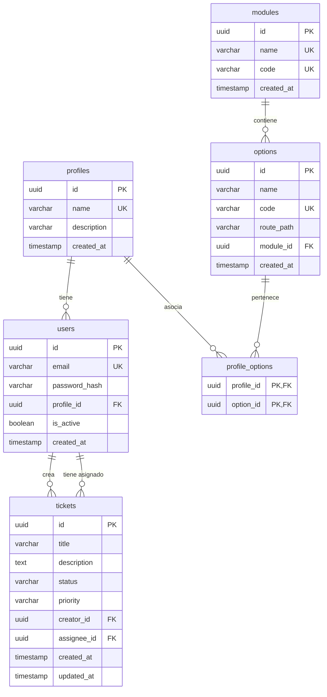

# Plataforma de gestión de tickets

## Arquitectura Backend

El backend se construirá bajo los principios de **Clean Architecture** con una separación notable de responsabilidades en capas, para así, permitir cambiar detalles de infraestructura (como la base de datos o librerías externas) sin afectar la lógica de negocio.

### Estructura de Directorios (Folder Structure)
```text
backend/
├── src/
│   ├── config/             # Configuración de entornos, base de datos y JWT
│   ├── constants/          # Constantes, mensajes de error, roles y estados
│   ├── controllers/        # Controladores Express (manejo de entrada/salida HTTP)
│   ├── database/           # Migraciones, seeders y conexión
│   ├── errors/             # Clases de excepciones personalizadas (AppError, etc.)
│   ├── middlewares/        # Middlewares de Express (Auth, RBAC, validación, logs)
│   ├── models/             # Entidades/Esquemas de Base de Datos (ej. TypeORM/Prisma)
│   ├── repositories/       # Capa de persistencia (Data Access Object / Repository Pattern)
│   ├── routes/             # Enrutamiento de la API REST
│   ├── services/           # Reglas de negocio y lógica de aplicación (Use Cases)
│   ├── types/              # Declaración de tipos e interfaces de TypeScript
│   ├── utils/              # Funciones auxiliares (hash de contraseñas, JWT, helpers)
│   └── app.ts              # Inicialización y configuración de Express
├── tests/                  # Suite de pruebas automatizadas
│   ├── unit/               # Pruebas unitarias (Servicios, Repositorios mockeados)
│   └── integration/        # Pruebas de integración de la API (Controllers/Routes)
├── tsconfig.json
├── package.json
└── README.md
```

### Flujo de Datos y Capas
1. **Presentation Layer (Controladores & Rutas)**: Recibe las peticiones HTTP, valida la estructura del payload (ej. usando `Zod` o `class-validator`) y delega la ejecución al servicio correspondiente.
2. **Business Logic Layer (Servicios)**: Contiene las reglas del negocio de los tickets, usuarios, perfiles, etc. Coordina las transacciones y no sabe nada sobre Express.
3. **Data Access Layer (Repositorios)**: Interactúa directamente con PostgreSQL usando un ORM/Query Builder (como TypeORM, Prisma o Knex).
4. **Security & Middlewares**:
   - **Autenticación (JWT)**: Valida la firma del token en las cabeceras HTTP.
   - **Autorización (RBAC)**: Valida que el perfil del usuario tenga los permisos (Modules & Options) necesarios para consumir el recurso.

### Diseño de la Base de Datos (PostgreSQL)

Se propone un modelo relacional normalizado para soportar un RBAC dinámico e independiente:



#### Detalles del Modelo:
- **`profiles` (Perfiles)**: Representa los roles principales (ej: Administrador, Agente, Cliente).
- **`modules` (Módulos)**: Secciones generales del sistema (ej: Seguridad, Gestión de Tickets, Administración).
- **`options` (Opciones/Permisos)**: Acciones específicas dentro de un módulo (ej: Crear Ticket, Eliminar Usuario, Ver Módulos).
- **`profile_options`**: Tabla pivote para asociar perfiles y permisos, resolviendo el RBAC dinámico en base de datos.

### Estrategia de Testing (Backend)
- **Framework**: `Jest` o `Vitest` con `Supertest` para peticiones HTTP.
- **Unit Testing**: Pruebas de los `services` mockeando los `repositories`. Esto garantiza el testeo puro de la lógica de negocio.
- **Integration Testing**: Pruebas de endpoints completos utilizando una base de datos PostgreSQL de prueba o en memoria (ej. `pg-mem` o Docker de Postgres para pruebas).
- **Cobertura**: Excluir archivos de configuración, declaraciones de tipo y migraciones del cálculo de cobertura. Configurar Jest con `collectCoverage: true` y umbral global en 80%.

---

## 2. Arquitectura Frontend (Angular 21)

Se adopta una estructura de **Arquitectura Modular basada en Características (Feature-driven / Core-Shared-Features)**, empleando las últimas novedades de Angular 21 (Standalone Components, Signals, Functional Guards e Interceptors).

### Estructura de Directorios
```text
frontend/
├── src/
│   ├── app/
│   │   ├── core/               # Singleton Services, Guards globales, Interceptores, State
│   │   │   ├── auth/           # AuthService, login guard, token handler
│   │   │   ├── interceptors/   # JwtInterceptor, ErrorInterceptor
│   │   │   ├── services/       # HttpClient wrappers, logs globales
│   │   │   └── state/          # Global State / Signals (ej. user profile, modules layout)
│   │   ├── shared/             # UI Components reutilizables, Pipes y Directivas comunes
│   │   │   ├── components/     # custom-table, dynamic-modal, button-spinner
│   │   │   ├── directives/     # has-permission.directive.ts (RBAC visual)
│   │   │   └── pipes/          # date-format, truncate
│   │   ├── features/           # Módulos de negocio (Lazy Loaded)
│   │   │   ├── auth/           # Login / Recuperar clave
│   │   │   ├── dashboard/      # Vista principal / Estadísticas rápidas
│   │   │   ├── admin/          # Gestión de Users, Profiles, Modules y Options
│   │   │   └── tickets/        # Gestión de Tickets (Creación, Listado, Seguimiento)
│   │   ├── app.config.ts       # Configuración global de la app (Providers, HTTP, Router)
│   │   ├── app.routes.ts       # Rutas principales con Lazy Loading y Guards
│   │   └── app.component.ts    # Componente raíz
│   ├── assets/                 # Recursos estáticos (estilos, logos, iconos)
│   └── index.html
├── src/styles.css              # Variables de diseño (CSS Custom Properties) y estilos base
├── package.json
└── angular.json
```

### Gestión de Estado (State Management)
- **Angular Signals**: Se descarta NgRx para evitar boilerplate innecesario en una aplicación administrativa basada en CRUDs. Se utiliza la reactividad nativa de Angular 21 con Signals (`signal`, `computed`, `effect`) dentro de servicios globales (ej: `AuthService` expone un `currentUser = signal<User | null>(null)` y `userPermissions = computed(...)`).

### Flujo de HTTP e Interceptores
1. **`JwtInterceptor`**: Captura cada petición saliente y le inyecta la cabecera `Authorization: Bearer <token>` si hay un token válido en memoria/localStorage.
2. **`ErrorInterceptor`**: Captura las respuestas con códigos `4xx` y `5xx`. Si recibe un `401 Unauthorized`, gatilla el cierre de sesión automático o la renovación de token (refresh token) y redirige al login.

### Enrutamiento y Seguridad Visual (Guards & Directivas)
- **Functional Guards**: `authGuard` para proteger rutas privadas y `permissionGuard` para validar si el perfil del usuario tiene acceso al módulo cargado.
- **`HasPermissionDirective` (`*hasPermission`)**: Directiva estructural para ocultar o deshabilitar elementos del DOM (como botones de "Editar" o "Eliminar") basándose en las opciones asignadas al perfil del usuario actual.

### Estrategia de Testing (Frontend)
- **Framework**: `Jasmine` + `Karma` (o `Jest` para rapidez).
- **Unit Testing**: Testeo de servicios HTTP mockeando `HttpClientTestingModule` y validación de componentes de UI utilizando `ComponentFixture`.
- **Signal Testing**: Verificar que los cambios de estado en los servicios reactivos actualizan correctamente las vistas y las variables computadas.

---

## 3. Riesgos Técnicos y Mitigaciones

1. **Riesgo: Complejidad de las Pruebas Unitarias en el Frontend (Angular 21)**
   - *Detalle*: Componentes pesados con muchas dependencias de servicios HTTP o del enrutador pueden dificultar la escritura de pruebas, bajando el porcentaje de cobertura.
   - *Mitigación*: Mantener los componentes en Angular lo más "tontos" o de presentación posible (*presentational components*), delegando la lógica pesada a servicios puros que son mucho más fáciles de testear.
2. **Riesgo: RBAC Demasiado Rígido o Complejo de Mantener**
   - *Detalle*: Un control de accesos dinámico mal diseñado puede ralentizar las peticiones HTTP por constantes consultas de permisos a la base de datos.
   - *Mitigación*: Implementar almacenamiento en caché (ej. en memoria en el servidor o mediante cookies firmadas) del mapa de permisos del usuario al autenticarse, reduciendo las consultas a base de datos en peticiones subsiguientes.
3. **Riesgo: Control de Concurrencia en Tickets**
   - *Detalle*: Dos agentes de soporte pueden intentar actualizar el mismo ticket al mismo tiempo, resultando en pérdida de datos.
   - *Mitigación*: Implementar bloqueo optimista (*Optimistic Locking*) en el backend usando una columna `version` o `updated_at` en la tabla de tickets para rechazar actualizaciones basadas en datos obsoletos.
4. **Riesgo: Exposición de Datos Sensibles en JWT**
   - *Detalle*: Guardar información crítica de roles o datos personales en el payload del token.
   - *Mitigación*: El payload de JWT debe contener únicamente el `userId` y `profileId`. El mapa de permisos detallado debe cargarse en el backend tras validar el token o enviarse en el cuerpo de respuesta del Login para el Frontend.
